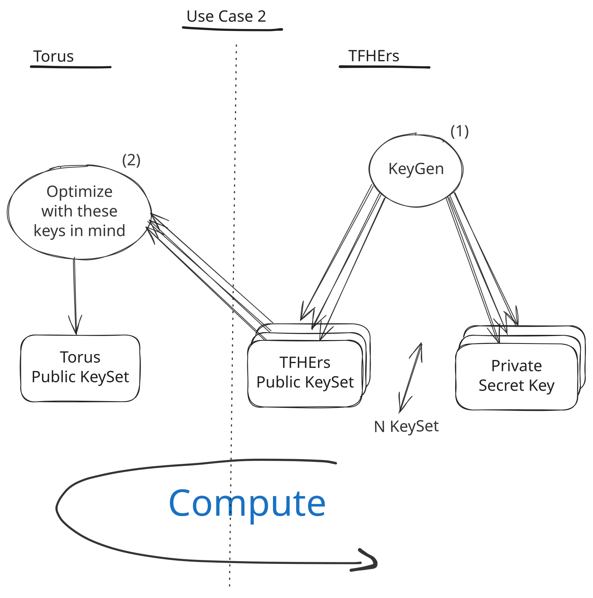

# Scenario 2: Pregenerated Lux-FHE keys

This document provides an overview of the second use case for combining Lux-FHE and Torus, where two parties work with pregenerated Lux-FHE keysets. The focus is on how to perform computations on encrypted Lux-FHE values using Torus, without the need for a shared secret key.

This scenario is interesting in the case of threshold cryptography, when the secret key is not known by a single party but split into different parties, and when the secret key cannot be changed (e.g. because it's a permanent key of an encrypted blockchain).

This use case is not managed currently by Torus and will be available later.

In this scenario, two parties have a predetermined set of Lux-FHE keysets. The goal is to compute on encrypted Lux-FHE values in Torus, but without sharing any secret key. Instead, the party using Torus will rely only on Lux-FHE public keys and will optimize its operations according to the parameters associated with those keys. Meanwhile, the party using Lux-FHE will have the capacity to perform encryption, decryption, and computation.

## Workflow

The workflow for this scenario is as follows:

1. We generate multiple keysets (including secret keys and public keys) with different sets of parameters.
2. Considering the public keys, Torus's Optimizer will limit its parameter search space to find the best configuration that is compatible with the existing Lux-FHE keys.

## Use case

This approach is particularly useful in scenarios involving threshold cryptography, where the secret key is distributed across multiple parties. This setup is beneficial when the secret key cannot be modified, such as in situations where the key is a permanent fixture, like in encrypted blockchains.

## Future Support

Currently, this use case is not supported by Torus but will be available later.
